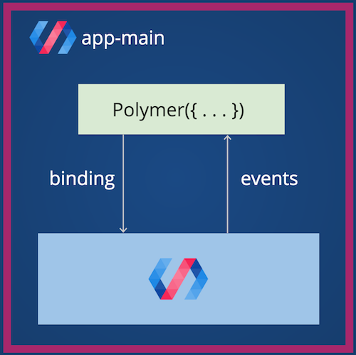
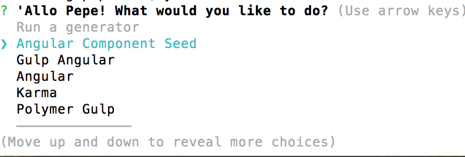
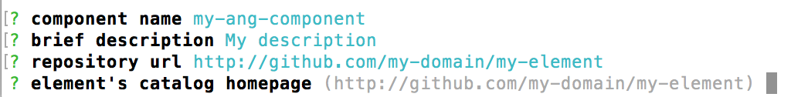
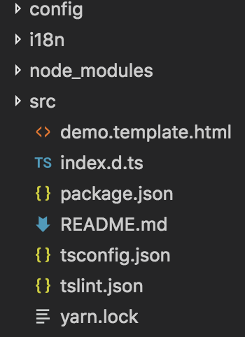
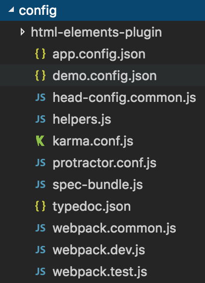
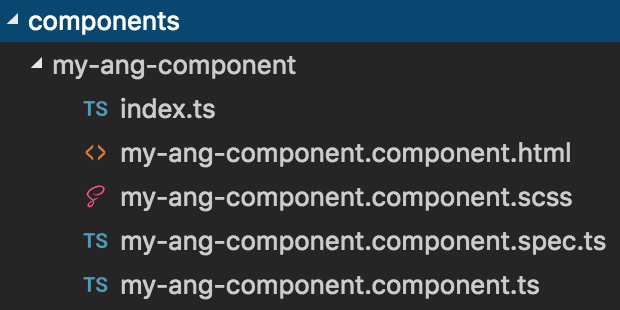
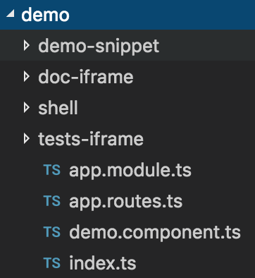

# Componentization

## Steps to a good componentization

* Each component should have an independent repository in order to be added as a dependency in the main project´s configuration files, such as the package or bower jsons .

* In order to build an independent and reusable component, the developer should abstract himself from the complete application and look for the concrete functionality that the component has to fill, and avoid the use of multiple dependencies.

* Take some time to understand how works the data flow in Polymer or Angular 2. Every component receives properties by data binding, using attributes on the component instantiation from the father. The communication between the children and their parents, should use native system events for a complete abstraction, such as Polymer Fire or Angular EventEmitter.
    
  This is very important, because using events for communication avoid the direct references between components.

* Search for complete and independent functional blocks. A unique button is not a good component, a button with a text field to validate/send/create a field is a good component. A unique component has to gave a concrete functionality to the developer, following the [Single Responsability Principle](https://en.wikipedia.org/wiki/Single_responsibility_principle). The granularity of the component has to be defined by the work team, in order to be as useful as possible. 

* The Web Components should be stateless elements, delegating this state management to a superior level in the components hierarchy. 

* Is important to add as much abstraction capabilities as we can, in order to make easier the personalization of the components and their evolution . For example, the developers should create one CSS3 custom variable for each property sensible to change, like border colors, text color or the standard padding of the component. 

* Don´t create a component for every part of your application. Just create a independent and reusable component when the element can be reused in other contexts or applications. The exceed of components is the worse problem that you can have working with an component-oriented architecture

* The Definition Of Done list of a component should be:
    - <strong>Reusable</strong>: The component is ready to be used if the developer imports it from node_modules / bower_components.
    - <strong>Independent</strong>: It has to be able to run without an external service or dependencies.
    - <strong>Tested</strong>: The component has to be tested and has at least 60% of coverage in his unit test.
    - <strong>Documented</strong>: The component has to be a complete documentation, generated with the current conventions, in order to be easy to be used by the developers, presenting inputs/properties, available methods and personalization style rules.

## Angular component yeoman generator.

A scaffolding tool for auto generating a basic Angular 2 component using yeoman.
 
It comes with preconfigured automatic build tasks, a testing template, autogenerated documentation and SASS support.

## Install

#### Install Yeoman
```
$ npm install -g yo
```
More information in [Yeoman web site](http://yeoman.io/).

#### Install this generator template as a global package

In a terminal run:

```
$ npm install -g https://github.com/serenity-frontstack/angular-component-seed-generator.git
```

#### Generating your seed element

In order to get your basic scaffolding for a component:

```
$ yo angular-seed-component
```

Or type `yo` and choose `Angular Component Seed`.



#### Type the parameters



And type `npm run serve` to load your component.

## Structure

#### The generator will create this architecture:



#### config 
In this folder there are all configuration files that needs the project, like Webpack or TypeScript config.



#### components 
In this folder is the component that we are going to develop.



#### demo 
It has all the files related to the demo page.
Like the side menu or sample container of the component.

