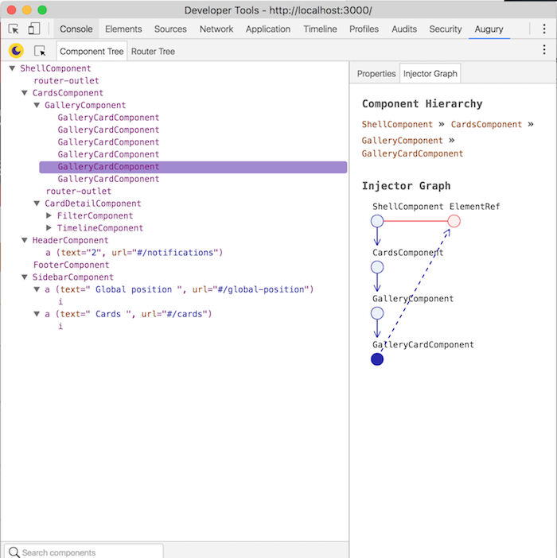

# Debug Tools

## Debugging on Angular 2

### Using browser inspector

By default debugging is enabled in Angular 2 applications. Whenever you deploy your application in a production environment you should disable debugging information and switch into production mode. If you are using the [Serenity-Frontstack Starter Kit](https://github.com/serenity-frontstack/angular2-basic) this settings are visible on src/app/app.environment.ts
 
    if ('production' === ENV) {
        disableDebugTools();
        enableProdMode();
    }

On development mode, you can select the component element on the DOM and execute the following command in the console in order to show the component instance information.

    ng.probe($0).componentInstance

This comand is similar to the Angular 1 debug practice:
    
    angular.element($0).$scope

### Augury

[Augury](https://augury.angular.io/) is aGoogle Chrome Developer Tool extension for debugging and profiling Angular 2 applications.Augury helps Angular 2.0 developers visualize the application through component trees, and visual debugging tools. Developers get immediate insight into their application structure, change detection and performance characteristics.

Augury only works with applications in Development Mode. To learn more about this and how to use it, you can read the developer guide in their [official site](https://augury.angular.io/pages/guides/)

## Debugging on Polymer

(Polymer DevTools Extension)[https://chrome.google.com/webstore/detail/polymer-devtools-extensio/mmpfaamodhhlbadloaibpocmcomledcg] is very usefull when the developer can´t see or understand the web components registration and life cycle events
 
In Google Chrome, you can select the selected element of the DOM with the $0 command. This allows the developer to access the properties of the selected component. 